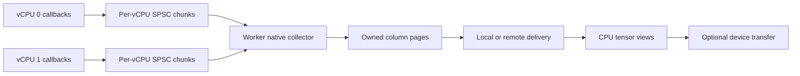

# Capture and tensor efficiency investigation

Reviewed 2026-09-07 against cpu2tensor 0.2.0 and the sibling AlphaFlow checkout.
This is a source audit and analysis of saved benign fixture traces, not a timing
benchmark. Runtime code is unchanged. Use the ownership/publication pattern from
AlphaFlow as a reference; do not transplant its implementation.

## Findings in cpu2tensor

The plugin runs inside QEMU's host process, on its vCPU callback threads. Work in
those callbacks delays guest execution. Tensor creation currently happens later
on the learner, but transport writes happen inside those callbacks.

| Boundary | Current behavior | Consequence |
| --- | --- | --- |
| Per-vCPU state | Separate aligned frame, sequence and register scratch | No shared event counter or application mutex around guest blocks |
| Event append | Flush on every change between block/register/memory kind | Rich traces produce tiny frames despite the 4 KiB frame capacity |
| Publication | Blocking write to one shared pipe, with SIGPIPE mask block/restore | Kernel-mediated transport and possible stalls run directly on guest execution threads |
| Worker | Read header and body, validate records, forward each frame | More poll/read/send calls as frames shrink; one shared transport bottleneck |
| Learner | Receive buffers, concatenate frame, validate and transcode to columns | Extra copies and allocations before the zero-copy CPU tensor views |
| Device | One synchronous conversion per column; MPS synchronization per batch | Small frames also multiply tensor and device dispatch costs |

Source anchors: `native/qemu/plugin.cpp:68` (`publish`), `:124` (`flush`), `:141`
(`append`), `:277` (register sampling), `:336` (block entry), `:348` (memory);
`native/worker/main.cpp:152` and `:245`; `native/python/module.cpp:53`;
`python/cpu2tensor/pool.py:140` and `:165`.

Normal callback code uses preallocated storage. Register descriptors, prior values,
and the 64 KiB scratch buffer are allocated at source initialization. The append
path has no explicit allocator call, but allocation-free is not a measured promise
about every QEMU/library path or first-touch page faults.

Register change suppression saves output, not register reads. Every block samples
all selected registers through public QEMU calls, compares them with prior values,
and copies changed values into both the event and saved state. The tested ARM
profile reads 34 registers per checkpoint. A ring cannot remove this cost. Keep
sampling semantics fixed when comparing implementations; reducing the selected
registers or checkpoint frequency would change the observation contract.

The matching operator QEMU source uses the current CPU's GDB register reader:
`plugins/api.c:463`, `gdbstub/gdbstub.c:529`, `target/arm/gdbstub64.c:35` under the
source tree recorded in [the probe](instrumentation-probe.md). No global register
lock appears in this inspected call chain. The private AlphaFlow x86 bulk reader
is not a portable replacement. Memory values must also be read in the actual
callback; a later collector cannot reread guest state to recover the transaction.
Values-off avoids our getter and value payload, but QEMU's generated callback
path still has value-save instructions (`tcg/tcg-op-ldst.c:194`); do not claim all
underlying value work disappears.

## Saved trace shape

On `trail-arm` (Ubuntu AArch64), the previous `signals_target` capture checks used
operator QEMU 11.0.3. The x86 guest also ran on that ARM host. The files were parsed
in place under `~/.cache/cpu2tensor/signals-capture-check`. No new workload ran and
no elapsed time or throughput was measured. These are earlier direct-capture
artifacts, distinct from the later endpoint runs in [results](instrumentation-results.md).

| Saved capture | Events | Data frames | Total bytes | Header share |
| --- | ---: | ---: | ---: | ---: |
| ARM, blocks only | 18,338 | 72 | 149,104 | 1.61% |
| ARM, general registers, memory, values off | 100,885 | 45,383 | 3,565,832 | 40.73% |
| ARM, general registers, memory, values on | 100,885 | 45,383 | 4,057,512 | 35.79% |
| x86 guest, all registers, memory, values on | 157,418 | 88,178 | 6,447,288 | 43.77% |

Headers include schema/control frames; data frames include only block/register/
memory frames. ARM rich capture averages 2.22 events per data frame; 14,835 of its
16,525 block frames contain one address. Frame count implies publication calls in
the current producer, not an observed syscall timing. Do not compare these ISA
rows as performance results.

Exact capture identities (SHA-256):

```text
a22b1f4f7d2d1ac54d78f7858dbcad85c328c920816c30e6dd111657df99f150  arm-none-off-off.trace
2f8bdb4eecdbffdc72b9b8bdc500b3abdb1d1b747f2a4059d34cfc40b0cd3dda  arm-general-on-off.trace
f23ce0417df2827e7048984a9ce93a8ff0bca77db013e96a097854b0d6c224d1  arm-general-on-on.trace
d4566f4e1972e5a17cf4f759dd6c02a685c5f372af30bcfabb82b5d0dc9fffe6  x86-all-on-on.trace
```

To reproduce the counts, unpack each 32-byte header as `<IHHIIQQ`. Check magic
and version 2, then advance by `32 + count*8` for kind 2, `32 + detail` for kinds
6/7/8, and 32 for control kinds. Sum count for kinds 2/7/8; count all headers for
header share. Check each source's sequence while walking and require exact EOF.

## What AlphaFlow actually provides

Paths in this section are relative to
`AlphaFlow/tasks/execution-exploration/experiments/reachability-v0/`.
The live C plugin and Torch extension still use older C components; the newer
native C++ tree is not proof those improvements are on the executing path.

- `plugin/block_plugin.c:954`: one producer per vCPU, producer-private cursor,
  cached consumer progress, ordinary record stores, and release publication in
  batches (default 64). When capacity exists, record production needs no syscall
  or per-event allocation. `plugin/trace_ring_drain.c:79` acquire-loads published
  progress and release-publishes reclamation after its visitor consumes records.
- `native/reachability/spsc_ring.hpp:38`: producer and consumer cursor regions
  are separated by 64 bytes. Check host coherence granules and alignment before
  assuming this removes false sharing on every supported host.
- `plugin/block_plugin.c:971`: the live full-ring loop busy-spins indefinitely
  without cancellation or collector-liveness checks. The C++ producer's timeout
  in `native/reachability/ring.hpp:317` does not fix the live C path.
- `native/reachability/ring_drain.hpp:98`: draining starts at source zero and
  processes an entire published snapshot. Repeated output exhaustion can favor
  earlier sources. Partial producer batches also need explicit publication when
  a source becomes idle, exits, or reaches a control boundary.
- The staging core is a preallocated SPSC state machine with generation checks.
  This is a useful ownership pattern, not a guarantee about the entire pipeline.
  `native/torch_extension/module.cpp:27` uses a process-wide mutex for registry
  lookups and keeps sessions/pools for process lifetime.
- `native/torch_extension/transcoder_session.cpp:142` first materializes an ordinary CPU page;
  `native/torch_extension/module.cpp:122` and `native/arch/cuda/slab_pool.cpp:339`
  implement the following host copy. The CUDA path
  then copies that page to pinned storage and copies the full allocated slab to
  the device. `native/arch/cuda/slab_pool.cpp:117` allocates one device buffer per
  slot; `:215` uploads into that reused buffer, and `:293` returns non-owning views.
  `:230` recycles the paired slot after upload completion alone. A retained view
  or model still using that device buffer can be overwritten by a later upload.
  The manual recycle entry at `:259` does not enforce copy completion either.
- `runtime/trace_transcoder.c:195` and `native/src/trace_transcoder.cpp:168`
  accept one input context and reject a second vCPU.
  Multi-vCPU ring draining therefore does not establish multi-vCPU tensor support.
  The extension's `native/torch_extension/CMakeLists.txt:58` links older C runtime/
  tensor/plugin code, so inspect actual linkage when using reference evidence.

Use “lock-free publication while capacity is available” for the relevant ring
property. Lossless capture with bounded storage must eventually wait when its
consumer stops; the full path is not unconditionally lock-free or wait-free.
Neither ring publication nor collector polling defines guest memory order.

## Proposed implementation boundary



One producer owns each ring; exactly one collector drains it. Keep mixed event
kinds in each published chunk so a kind switch does not force transport. Capture
register and transaction bytes immediately into bounded, preallocated storage.
Publish completed chunks with release/acquire ordering and cache opposite-side
progress. Preallocate/prefault storage during setup where supported. Cold setup,
slow full-ring waits, and shutdown are separate from the normal callback path.

The existing worker is the collector process: it can own the shared mappings,
apply bounded rotating drain quotas, and build column pages. No Torch, socket
write, global event lock, or model work belongs in a normal vCPU append. Waiting
for storage must be cancellable; cancellation and errors need a path that works
when the data ring is full. An empty/idle source must not prevent draining others.
Final progress must be visible before completion, including short tails. Thread
ownership transfer at process shutdown must happen only after callbacks quiesce.

Keep a deliberate local transcode copy if it releases compact capture storage
quickly and moves column work off guest execution threads. Trying to expose a live
ring directly as retained tensors couples guest progress to arbitrary client
lifetimes. Direct production into leased column chunks is a later alternative to
measure, not a reason to erase that ownership boundary now.

For the learner, receive column payloads directly into their final CPU storage
when byte order/alignment permit; remove frame concatenation and a second native
transcode. A tensor's storage owner must hold its page until the last view releases
it. Pinned upload storage becomes reusable after upload completion AND release of
any CPU views. Reused device storage additionally requires all device consumers
and retained views to finish. Prefer ordinary owned device tensors initially;
custom device pooling requires an explicit stream/lifetime implementation.
No public trajectory IDs or async client protocol are needed for this ownership.

Batching different signals into column pages also needs an event-order mapping.
The existing `first_sequence + row index` rule only holds for consecutive events
of one kind. Do not merge separated runs and silently renumber them. Settle a
small versioned mixed-page contract (for example a per-source kind/row order table)
before parallel builders change producer and consumer. Current public semantics
remain unchanged during this investigation. Local shared-memory layout and remote
wire layout are separate contracts; never transmit pointers or shared atomics.

## Next bounded slice and checks

Implement the ring/collector boundary first, using existing wire records as a
compatibility bridge. Then integrate mixed column pages to remove the demonstrated
small-frame overhead through to Python. Do not call a pipe-to-ring replacement
alone a complete tensor-throughput fix.

Required checks: concurrent ARM/x86 producer/consumer stress with tiny capacities,
wraparound, independent vCPUs, stalled/idle sources, rotating fairness, final tails,
full-ring cancellation and dead collector; existing signal correctness and faults;
retained CPU/MPS tensors; CUDA upload and device-use lifetimes when hardware is
available. Re-run the actual endpoint path, not only a synthetic ring test.

Reserve the x86 host before measuring. Hold target, input, QEMU build, compiler,
register profile and checkpoint coverage fixed. Separately measure callback
capture, ring publication, collector/transcode, transport and learner/device work.
Report repetitions, target slowdown, allocations/syscalls, page faults, frame
occupancy, ring occupancy/stalls, CPU usage and peak memory. Compare no plugin,
blocks only, rich values off and rich values on; distinguish changed signal volume
from transport gains. ARM runs establish portability, not x86 throughput.
